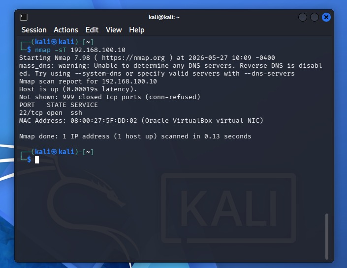

# Análise de varredura de Portas com Nmap e visualização no SIEM.

## Descrição do Projeto

O objetivo principal foi executar uma varredura intencionalmente agressiva contra um alvo Linux, analisar o comportamento dos pacotes diretamente no arquivo de log local (`auth.log`) e compreender a assinatura deixada por varreduras de rede antes de centralizar essa visibilidade em um SIEM (Security Information and Event Management).

---

## Execução

### 1. Varredura com Nmap (TCP Connect Scan)
Para gerar uma assinatura nítida e de fácil detecção nos logs, foi utilizada a varredura com nmap através da flag `-sT`. 

O fluxo técnico dessa varredura segue a seguinte mecânica:
* **Three-Way Handshake Completo:** O scanner estabelece a conexão TCP completa (`SYN` ➡️ `SYN-ACK` ➡️ `ACK`) para validar se a porta está efetivamente aberta.
* **Encerramento Abrupto:** Imediatamente após a confirmação da porta aberta, o scanner envia uma flag `RST` (Reset) para finalizar a conexão sem realizar a troca de dados legítima.

### 2. Análise do `auth.log`
Esse encerramento abrupto gera um padrão muito específico no arquivo `/var/log/auth.log`. O monitoramento desses logs locais revelou com precisão o mapeamento realizado, evidenciando a identificação da **porta 22 (SSH)** e a tentativa de fingerprinting do serviço.

---

## Relevância para Detecção e Resposta (Cyber Threat Intelligence)

Compreender a engrenagem por trás de um scan de portas é vital para analistas de SOC. Para um atacante, o mapeamento de portas e a descoberta de versões exatas de serviços representam a fase de **Reconhecimento**. 

A identificação bem-sucedida de um serviço como o SSH abre margem para:
* Busca por **CVEs** conhecidas em versões desatualizadas.
* Ataques de **Brute Force** direcionados.
* Exploração de falhas estruturais ou vazamentos de chaves de autenticação.

A assinatura identificada neste laboratório serve como base técnica para a criação de **regras de correlação e alertas no SIEM**, permitindo bloquear ou isolar o endereço IP do scanner antes que a fase de exploração seja iniciada.
