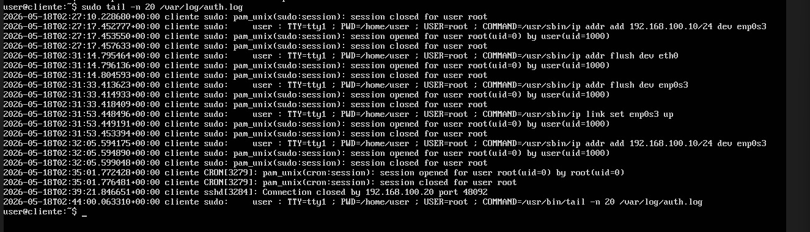
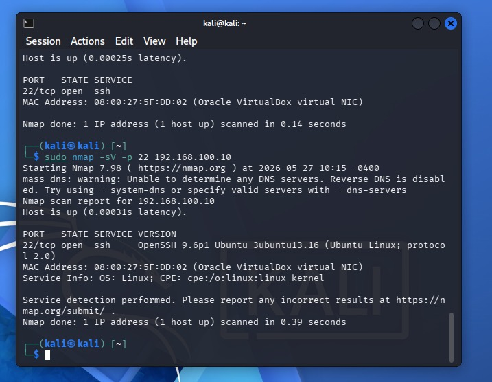
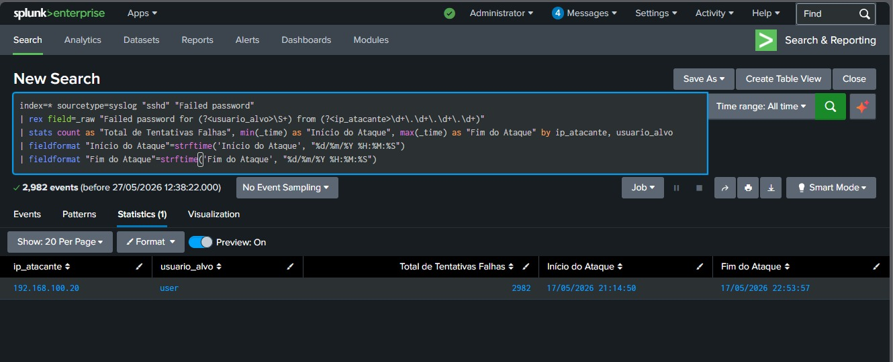
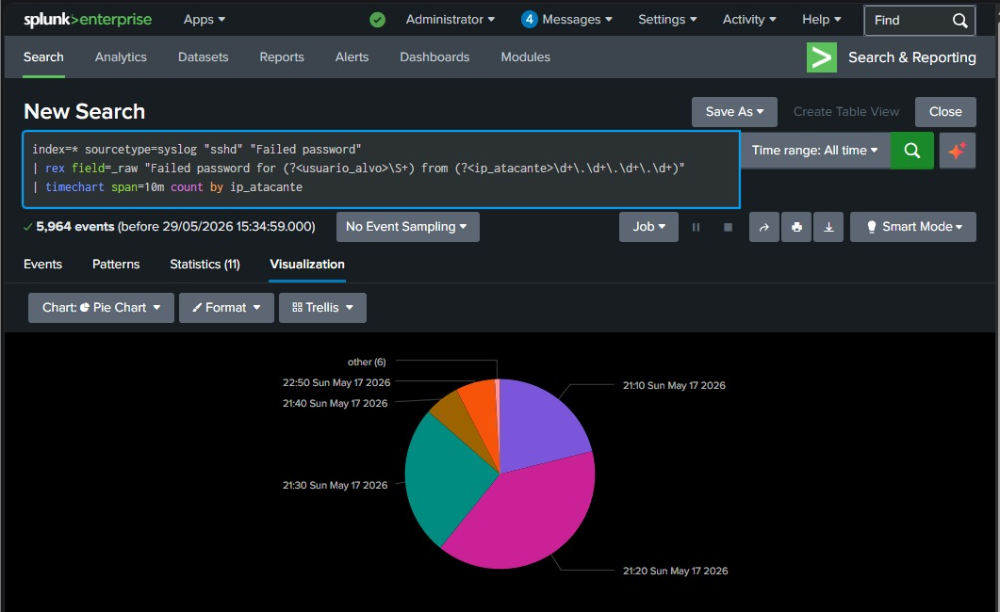

# Análise de Varredura de Portas com Nmap e Visualização em SIEM

## Descrição do Projeto

O objetivo principal deste laboratório foi executar uma varredura de rede intencionalmente agressiva contra um alvo Linux, analisar o comportamento dos pacotes diretamente no arquivo de log local (`auth.log`) e compreender a assinatura deixada por esse tráfego antes de centralizar e correlacionar a visibilidade em um SIEM.

Inverter a perspectiva — estudando o impacto no host de destino antes de construir as regras de correlação — é fundamental para compreender o ruído real que as ferramentas de varredura geram nos sistemas operacionais.

---

## Execução e Análise Técnica

### 1. Varredura com Nmap (TCP Connect Scan)
Para gerar uma assinatura nítida e de fácil detecção nos logs locais, utilizou-se a varredura do Nmap com a flag `-sT` (TCP Connect Scan). 

O fluxo técnico dessa varredura segue a seguinte mecânica:
* **Three-Way Handshake Completo:** O scanner estabelece a conexão TCP completa (`SYN` ➡️ `SYN-ACK` ➡️ `ACK`) para validar se a porta está efetivamente aberta.
* **Encerramento Abrupto:** Imediatamente após a confirmação da porta aberta, o scanner envia uma flag `RST` (Reset) para finalizar a conexão de forma abrupta, sem realizar uma troca de dados legítima.

### 2. Análise do `auth.log`
Esse comportamento anômalo (conexão seguida de reset imediato) gera um padrão muito específico no arquivo `/var/log/auth.log`. O monitoramento desses logs locais revelou com precisão o mapeamento realizado, evidenciando a identificação da **porta 22 (SSH)** e a tentativa de fingerprinting do serviço.

---

## 3. Relevância para Detecção e Resposta para SOC

Compreender a engrenagem por trás de um scan de portas é vital para analistas de SOC. Para um atacante, o mapeamento de portas e a descoberta de versões exatas de serviços (banner grabbing) representam a fase de **Reconhecimento** dentro do Cyber Kill Chain. 

A identificação bem-sucedida de um serviço exposto como o SSH abre margem para:
* Busca por **CVEs (Common Vulnerabilities and Exposures)** conhecidas em versões desatualizadas.
* Ataques de **Força Bruta (Brute Force)** direcionados.
* Exploração de falhas estruturais ou vazamentos de chaves de autenticação.

### 3. Correlação e Verificação de Brute Force no SIEM
Após a fase de reconhecimento do cenário, foi simulado um ataque de força bruta contra o serviço SSH. Com os logs locais já centralizados no SIEM, foi possível criar regras de correlação para quantificar e monitorar a atividade maliciosa em tempo real.

O painel abaixo exibe o volume total de tentativas de autenticação falhas executadas pelo atacante:

Para facilitar a triagem e o entendimento da linha do tempo do incidente pela equipe de resposta, os eventos foram plotados em um gráfico de quebra temporal, tornando visualmente evidente o pico de conexões anômalas:

---

## Conclusão e Aprendizados
Este laboratório reforça a importância da **Defesa em Profundidade**. Manter superfícies de ataque atualizadas e mitigar a exposição de versões de serviços são passos cruciais na redução de riscos. Além disso, o projeto demonstra o papel indispensável do SIEM no desenvolvimento de regras de correlação eficientes, permitindo que comportamentos suspeitos na camada de rede e de autenticação sejam detectados e contidos antes que se tornem um comprometimento real.
